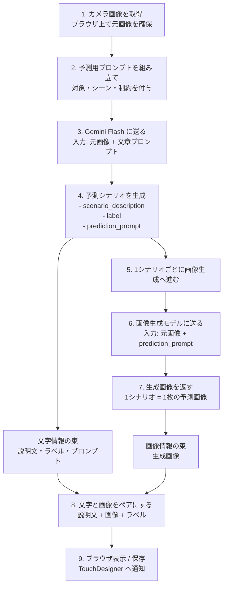

# 生成フロー図

この図は、予測操作の中で「文字の予測」と「画像生成」がどうつながっているかを示します。

## ここでのポイント

- まず「何が起きそうか」を Gemini Flash で文章として予測します。
- そのあと、各予測に対応する「見た目の画像」を画像生成モデルで作ります。
- つまり、1回の予測処理では「文字の予測」と「画像の生成」が分けて走り、最後にペアでまとめて扱います。

## 具体的なイメージ

1. 元画像を入力する
2. Gemini Flash が複数のシナリオを返す
3. 各シナリオに対して画像生成モデルが画像を生成する
4. その結果を「ラベル + 説明文 + 画像」のセットとして表示・保存する
