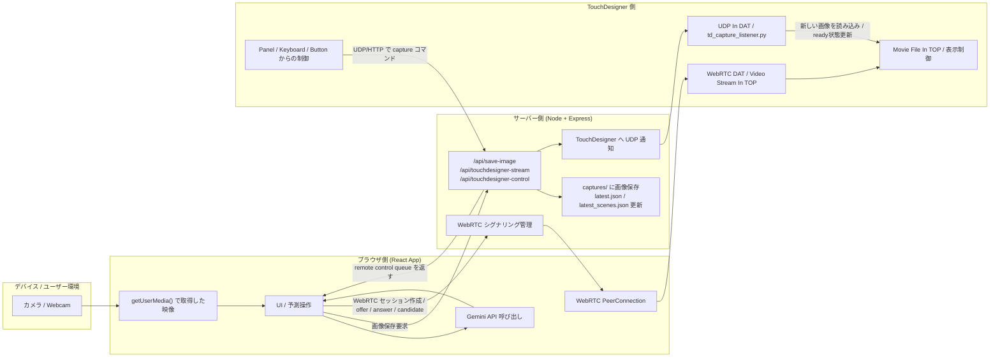

# 現在のシステム構成図

この図は、現在の実装に基づく「端末・ブラウザ・サーバー・TouchDesigner」の関係をまとめたものです。

## 主要な役割

### 1. デバイス側
- ユーザーのカメラ映像を取得します。
- ブラウザ側でその映像を使って予測処理を行います。

### 2. ブラウザ側
- React アプリが UI を担当します。
- カメラ映像を取得し、Gemini API に渡して将来シーンを予測します。
- 生成された画像をサーバーへ送信し、保存させます。
- TouchDesigner へライブ映像を配信するための WebRTC 接続も管理します。
- TouchDesigner からのリモート制御コマンドをポーリングして受け取ります。

### 3. サーバー側
- Express サーバーとして API を提供します。
- 画像保存リクエストを受けて captures/ 配下に保存します。
- latest.json と latest_scenes.json を更新して、最新キャプチャ状態を保持します。
- TouchDesigner へ UDP で JSON 通知を送信します。
- WebRTC のシグナリング用セッションも管理します。

### 4. TouchDesigner 側
- Browser から送られてくるライブ映像を受け取って表示できます。
- 画像保存通知を受けて Movie File In TOP を更新し、表示や演出制御を行います。
- ボタンやキーボード操作から capture コマンドを送って、ブラウザ側に新しい予測生成を要求できます。

## 主要なデータのやり取り

1. カメラ映像
   - デバイスのカメラ → ブラウザの getUserMedia()
   - ブラウザ → TouchDesigner へ WebRTC で配信

2. 予測・画像生成
   - ブラウザ → Gemini API
   - Gemini からの予測結果と画像をブラウザで受ける

3. 画像保存
   - ブラウザ → サーバーの /api/save-image
   - サーバー → captures/ に保存
   - サーバー → TouchDesigner へ UDP 通知

4. リモート制御
   - TouchDesigner → サーバーへ capture コマンド
   - サーバー → ブラウザにコマンドをキューとして渡す
   - ブラウザがそのコマンドを受けて再キャプチャを実行

## ひとことで言うと
- ブラウザが「見たもの」や「作ったもの」を中心に扱い、
- サーバーが「保存・通知・シグナリング」を仲介し、
- TouchDesigner が「受け取って演出・表示」する構成です。
